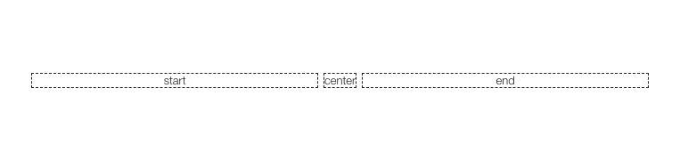
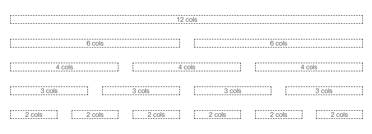
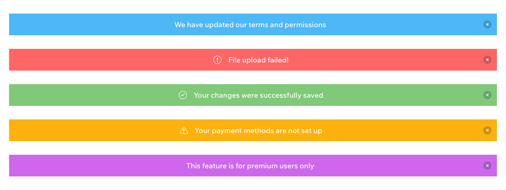

# Storybook Content Guidelines

This document explains how to write Storybook documentation in order to have consistent examples across the components. 
Storybook documentation provides information about components for UX designers and FED developers:
* It provides a full overview of the component and its usage (no alternative information sources should be needed to make a decision)
* It shows if a component is developed, in development or deprecated.
* It explains what's still in development or why it's deprecated and what to use instead.

<br>

## Page Structure

Each component story consists of following sections:


<br>

## Description Section

Description should provide enough information to make a decision if it’s a right component for a user case or an alternative solution should be selected instead. It should explain:

* The primary purpose of the component
* If it’s a building part for a larger component (i.e. ListItemSelect)
* Do and don't examples — when component should be used or should not (optional link to correct solutions per case)


Example:
> Modal controls the overlay layout that appears on call functions. It’s a container for components > like CustomModalLayout, ModalPreviewLayout and others.
> Use it:
> 
> * To reveal all types of modal layouts
> * To display a full page loading state

<br>

## Import Section

This section should provide a line of code which can be copied and pasted to the developer's project, so component can be used right away.

Example:

`import { AddItem } from 'wix-style-react';`

<br>

## Examples Section

Examples should demonstrate how component behaves and when to use it. In order to maintain consistency between stories, examples should go in this order:

1. Core structure
1. Properties
1. Common use cases

<br>

### 1. Core Structure

Container box components should give an example how it is constructed. The example should list all available areas. This example should:

* Visually display existing content areas and design possibilities it provides
* Explain each content area purpose and accepted content types in the description (e.g. node, string, image)
* Use default properties or placeholder content without additional styling

<br>

#### Visuals

Use schematic drawing to visualise content areas, when containers do not have a default content type and accept any kind of content (node). If there are multiple content areas use text to communicate how each area is called.

<table>
<tr>
    <td></td>
    <td></td>
  </tr>
  <tr>
    <td>
    	<br>
    	<strong>DO.</strong>
    	Use schematic drawings to communicate structural areas that accept node content type.
    </td>
    <td>
    	<br>
    	<strong>DON'T.</strong>
    	Don’t use sample content as it doesn’t visually explain multiple content areas.
    </td>
  </tr>
</table>

<br>
Showcase the effect of different values passed to the same prop if it helps to communicate the possibilities component provides. Use text to communicate what values have been passed and the effect it made.

<table>
<tr>
    <td></td>
    <td></td>
  </tr>
  <tr>
    <td>
    	<br>
    	<strong>DO.</strong>
    	Use content to communicate available options and difference it makes.
    </td>
    <td>
    	<br>
    	<strong>DON'T.</strong>
    	Don’t leave blank space and force user to check code to figure out difference in code.
    </td>
  </tr>
</table>

<br>
If a component has a predefined value types, stick to these to showcase primary and recommended usage of a component. If content type is text, use it to explain area name and purpose.

If i.e. ‘title’ also accepts node content, it should be mentioned in a description and API.
<table>
<tr>
    <td></td>
    <td></td>
  </tr>
  <tr>
    <td>
    	<br>
    	<strong>DO.</strong>
    	Use default styling for areas with predefined content types to set right patterns.
    </td>
    <td>
    	<br>
    	<strong>DON'T.</strong>
    	Don’t override predefined styling with placeholder content.
    </td>
  </tr>
</table>

<br>
Use other components from the library to explain mechanism containers behaviour, such as modal call out, native file upload, etc.

<table>
<tr>
    <td></td>
    <td></td>
  </tr>
  <tr>
    <td>
    	<br>
    	<strong>DO.</strong>
    	Use components from the library to explain behaviour, that is not visual.
    </td>
    <td>
    	<br>
    	<strong>DON'T.</strong>
    	Don’t use native HTML elements if library components are available.
    </td>
  </tr>
</table>


<br>

#### Description

Structure example description should state:

* What areas the component consist of (if there are multiple areas only)
* Which areas are mandatory and which are optional
* What type and amount of children elements areas accept 
* How to control component behaviour (for mechanism containers only)


<table>
<tr>
    <td>
	<i><strong>Structure</strong><br>
      	Render modal content by using children prop. Control modal appearance with props:
      	<ul>
   		<li>isOpen - this bool prop shows and hides the modal.</li>
		<li>onRequestClose - this prop calls a function you request. It can be used to control isOpen prop.</li>
      	</ul></i>
    </td>
    <td>
	<i><strong>Structure</strong><br>
      	A simple example for modal with an alert</i>
    </td>
  </tr>
  <tr>
    <td>
    	<br>
    	<strong>DO.</strong>
    	Give a meaningful description.
    </td>
    <td>
    	<br>
    	<strong>DON'T.</strong>
    	Don’t write a generic message that gives no value.
    </td>
  </tr>
</table>

<br>

### 2. Properties

Property examples step by step introduce users to component features. This section should reveal and explain full component capabilities, also how to handle common edge cases (i.e. text wrapping).

Each component has a set of properties and features to explain. Examples of them should be listed from least to most complex ones. Priority might differ depending on a component, but most commonly it follows this order:

* Appearance
* States
* Content
* Behaviour

<br>

#### Visuals

Be aware that users are visual learners by nature. Examples we provide should be as self explanatory as possible. 

In order to decide what content inside of a snippets would be suitable think about the following:

* What am I trying to communicate to the user (list of options to choose from, what behaviour property enables, etc.)?
* What is a property type (is it visual by its own, or does it need guidance)?
* How could we efficiently use initial component features to provide meaningful context?
* Could we help to set correct content patterns via snippets?

<br>
In cases where example lists down available value options use predefined component elements (if there are any) to communicate how passed value affects component appearance or behaviour.

<table>
<tr>
    <td></td>
    <td></td>
  </tr>
  <tr>
    <td>
    	<br>
    	<strong>DO.</strong>
    	Utilize component elements to communicate available prop values.
    </td>
    <td>
    	<br>
    	<strong>DON'T.</strong>
    	Don’t use meaningless placeholder titles which force you to look for information somewhere else.
    </td>
  </tr>
</table>


<br>
Merge statuses into a single snippet for interactive components. Use labels to communicate how each status is called.

<table>
<tr>
    <td></td>
    <td></td>
  </tr>
  <tr>
    <td>
    	<br>
    	<strong>DO.</strong>
    	Display all different states in a single snippet and use labels to display state name.
    </td>
    <td>
    	<br>
    	<strong>DON'T.</strong>
    	Don’t use placeholder labels when your intention is to communicate different states.
    </td>
  </tr>
</table>

<br>
Display single feature at the time. If example purpose is to list down the options, don’t complicate it with content which is not relevant at that specific moment.

<table>
<tr>
    <td></td>
    <td></td>
  </tr>
  <tr>
    <td>
    	<br>
    	<strong>DO.</strong>
    	Display content which is necessary to communicate example purpose only, i.e. existing states.
    </td>
    <td>
    	<br>
    	<strong>DON'T.</strong>
    	Don’t add content which is irrelevant in scenario you're showcasing (i.e. prefix icon in states example).
    </td>
  </tr>
</table>

<br>
In cases where property value affects the content which is allowed to be displayed inside of a component use real case examples. This approach provides the user with context what each value is designed for, and also sets right content patterns.

<table>
<tr>
    <td></td>
    <td></td>
  </tr>
  <tr>
    <td>
    	<br>
    	<strong>DO.</strong>
    	Use real case content which both explains when skin could be used and sets correct content patterns
    </td>
    <td>
    	<br>
    	<strong>DON'T.</strong>
    	Don’t communicate value names only when there’s a direct dependency between accepted messaging and selected theme.
    </td>
  </tr>
</table>


<br>
Use real content to demonstrate edge cases handling. It showcases the behaviour and sets correct content patterns at the same time. Avoid gibberish text that doesn't bring benefit.

<table>
<tr>
    <td></td>
    <td></td>
  </tr>
  <tr>
    <td>
    	<br>
    	<strong>DO.</strong>
    	Use real content for text overflow demonstration to set right content patterns.
    </td>
    <td>
    	<br>
    	<strong>DON'T.</strong>
    	Don’t use gibberish text which don’t bring benefit for a user.
    </td>
  </tr>
</table>


<br>
Merge directly dependent or same purpose properties into a single example (i.e. width and height could be a single example named ‘Dimensions’).

<table>
<tr>
    <td></td>
    <td></td>
  </tr>
  <tr>
    <td>
    	<br>
    	<strong>DO.</strong>
    	Display similar purpose properties in a single example.
    </td>
    <td>
    	<br>
    	<strong>DON'T.</strong>
    	Don’t create separate examples for similar purpose props. It increases story length unnecessarily.
    </td>
  </tr>
</table>


<br>
Don't merge property values which serve different purposes. Provide each of them with a dedicated example inside of the same snippet. Use real and meaningful copy to communicate purpose better.

> In example, selection items inside of a dropdown layout can be grouped using subheader or divider, but intentions are different. Subheader provides a name for a group. While divider separates list item that provide entirely different results, i.e. will add another field to the form where you can specify a custom length of a plan.

<table>
<tr>
    <td></td>
    <td></td>
  </tr>
  <tr>
    <td>
    	<br>
    	<strong>DO.</strong>
    	Have separate examples for different purpose prop values. Use real content to communicate purpose clearly.
	</td>
    <td>
    	<br>
    	<strong>DON'T.</strong>
    	Don’t merge prop variations with different intentions in a single layout. It doesn't explain clearly how they differ.
    </td>
  </tr>
</table>


<br>
List property examples in order of priority. Check the table below for the most common order and examples which properties could be merged together in a single example.

> Note: Order in which properties are listed can and should be adjusted depending per component and its most commonly used props

<strong>1. Appearance</strong><br>
List of properties that controls visual look and feel of a component

<table>
	<tr>
		<th>Group</th>
		<th colspan=7>What to show in a single snippet?</th>
	</tr>
	<tr>
		<td><strong>Size and Layout</strong><br></td>
		<td>size</td>
		<td>width<br>height</td>
		<td>alignment</td>
		<td>position</td>
		<td>direction</td>
		<td>padding<br>margin</td>
		<td>maxWidth<br>maxHeight<br>ellipsis<br>textWrap<br>overflow</td>
	</tr>
	<tr>
	    <td><strong>Style</strong><br></td>
	    <td>skin</td>
	    <td>primary<br>secondary</td>
	    <td>shape</td>
	    <td>color<br>backgroundColour<br>textColor</td>
	    <td>border<br>borderRadius<br>borderWidth</td>
	    <td>highlightedRow<br>importantColumn</td>
	    <td>shadow</td>
	</tr>
	  

</table>

<strong>2. States</strong><br>
List of predefined states of a component and when they should be displayed

<table>
	<tr>
		<th>Group</th>
		<th colspan=7>What to show in a single snippet?</th>
	</tr>
	<tr>
		<td><strong>Status</strong><br></td>
		<td>selected<br>disabled<br> selected disabled</td>
		<td>unchecked<br>checked<br>error<br>disabled<br>checked disabled</td>
		<td>defaultSelected</td>
		<td>eror<br>warning<br>loading</td>
		<td>status</td>
		<td>statusMessage</td>
		<td>readOnly<br>disabled</td>
	</tr>
</table>

<strong>3. Content</strong><br>
List of properties that allow to customise content

<table>
	<tr>
		<th>Group</th>
		<th colspan=7>What to show in a single snippet?</th>
	</tr>
	<tr>
		<td><strong>Content Areas</strong><br></td>
		<td>header<br>footer<br>footnote</td>
		<td>toolbar<br>subtoolbar</td>
		<td>suffix<br>prefix</td>
		<td>tooltip</td>
	</tr>
	<tr>
		<td><strong>Text</strong><br></td>
		<td>overline<br>title<br>subtitle<br>description</td>
		<td>additionalInfo</td>
		<td></td>
		<td></td>
	</tr>
	<tr>
		<td><strong>Visual content</strong><br></td>
		<td>illustration<br>thumbnail<br>image</td>
		<td>avatar</td>
		<td>badge</td>
		<td></td>
	</tr>
	<tr>
		<td><strong>Actions</strong><br></td>
		<td>action<br>actionText</td>
		<td>primaryAction<br>secondaryAction</td>
		<td></td>
		<td></td>
	</tr>
</table>

<strong>4. Behaviour</strong><br>
List of properties that control component behaviour or enable specific functionality for it
<table>
	<tr>
		<th>Group</th>
		<th colspan=7>What to show in a single snippet?</th>
	</tr>
	<tr>
		<td><strong>Data loading</strong><br></td>
		<td>lazyLoading</td>
		<td>infiniteScroll<br>pagination</td>
		<td></td>
		<td></td>
	</tr>
	<tr>
		<td><strong>Display</strong><br></td>
		<td>lazyLoading</td>
		<td>horizontalScroll</td>
		<td>overflow</td>
		<td>resizable</td>
	</tr>
	<tr>
		<td><strong>Other</strong><br></td>
		<td>spellChecking</td>
		<td>reordable</td>
		<td>custom HTML tag</td>
		<td></td>
	</tr>
</table>

<br>
Use content to communicate hard to notice functionality for the end user:

<table>
<tr>
    <td></td>
    <td></td>
  </tr>
  <tr>
    <td>
    	<br>
    	<strong>DO.</strong>
    	Use content to visualise behaviour of not so obvious features.
	</td>
    <td>
    	<br>
    	<strong>DON'T.</strong>
    	Don’t use meaningless placeholder copy that leaves user to figure out what needs to be done by himself.    </td>
  </tr>
</table>

<br>
Guide users with content if they are required to make an action to see a feature or functionality:

<table>
<tr>
    <td></td>
    <td></td>
  </tr>
  <tr>
    <td>
    	<br>
    	<strong>DO.</strong>
    	Provide guidance for the hidden features (i.e. error message will be displayed in a tooltip on hover).
	</td>
    <td>
    	<br>
    	<strong>DON'T.</strong>
    	Don’t leave features partially explained. It’s easy to miss functionality which is explained only in API or longer descriptions.</td>
  </tr>
</table>

<br>
Add external labels to communicate changes that happen in code for non visual features:

<table>
<tr>
    <td></td>
    <td></td>
  </tr>
  <tr>
    <td>
    	<br>
    	<strong>DO.</strong>
    	 Add labels if component change is not visual to help user figure out the difference instantly.
	</td>
    <td>
    	<br>
    	<strong>DON'T.</strong>
    	Don’t leave visual examples unexplained. This will require user to check the code to see a difference.</td>
  </tr>
</table>

<br>

#### Description

Property example should always be followed by a description explaining how and when to use it. Depending on a property type description could state:

* what purpose property should be used for <strong>(mandatory)</strong>
* what property values are available and what each option is used for
* what is a default value
* what are accepted child element types

> Tip: always start writing description with a verb

Selection of examples how to write example descriptions:

<table>
	<tr>
	<td><br></td>
    	<td>
      		<strong>Skin</strong><br>
      		Highlights the purpose of an action. It supports 3 skin types.
      		<ul>
      			<li>standard (default)- use in common layouts</li>
      			<li>dark - use in longer list of actions (>5) in order to not overwhelm the user</li>
      			<li>destructive - use for destructive actions only</li>
      		</ul>
    	</td>
  </tr>
  <tr>
		<td><br></td>
    	<td>
      		<strong> Skin </strong><br>
      		Supports three different skins: standard, dark & destructive.
    	</td>
  </tr>
</table>

<table>
	<tr>
	<td><br></td>
    	<td>
      		<strong>Shape</strong><br>
      		Defines intent of an input. It supports 2 shape types:
      		<ul>
      			<li>round (default)- use in modals and popover menus when it acts as a search</li>
      			<li>square - use when input is a part of general form</li>
      		</ul>
    	</td>
  </tr>
  <tr>
	<td><br></td>
    	<td>
      		<strong>Shape</strong><br>
      		AddressInput can be either round or square depending on the roundInput prop (default: true).
    	</td>
  </tr>
</table>

<table>
	<tr>
	<td><br></td>
    	<td>
      		<strong>Size</strong><br>
      		Adjust the component size using size prop. It supports 3 sizes:
      		<ul>
      			<li>large - use it in onboarding flows, where input needs emphasis </li>
      			<li>medium (default) - use in all common cases</li>
      			<li>small - use in more dense and narrow layouts</li>
      		</ul>
    	</td>
  </tr>
  <tr>
	<td><br></td>
    	<td>
      		<strong>Size</strong><br>
      		Supports three sizes: large, medium and small.
    	</td>
  </tr>
</table>

<table>
	<tr>
	<td><br></td>
    	<td>
      		<strong>States</strong><br>
      		Defines checkbox selection state. Component supports 5 states:
      		<ul>
      			<li>unchecked (default)</li>
      			<li>checked - use to mark selected option</li>
      			<li>error - use in validation to highlight mandatory item</li>
      			<li>disabled - use to indicate that option cannot be selected</li>
      			<li>disabled checked - use to indicate that option cannot be removed from selection</li>
      		</ul>
    	</td>
  </tr>
  <tr>
	<td><br></td>
    	<td>
      		<strong>States</strong><br>
      		Checkbox can be either checked, unchecked, has error or disabled.
    	</td>
  </tr>
</table>

<table>
	<tr>
	<td><br></td>
    	<td>
      		<strong>Status</strong><br>
      		Control component status using status prop. It supports 3 states:
      		<ul>
      			<li>error - use to highlight invalid input value</li>
      			<li>warning - use to highlight inputs that values impact user business or can’t be validated.</li>
      			<li>loading - use to show that the value is being uploaded to the server</li>
      		</ul>
    	</td>
  </tr>
  <tr>
	<td><br></td>
    	<td>
      		<strong>Status</strong><br>
      		Supports error, warning and loading status.
    	</td>
  </tr>
</table>

<table>
	<tr>
	<td><br></td>
    	<td>
      		<strong>Prefix Icon</strong><br>
      		Allows to provide additional clarity to an action with a visual clue.
    	</td>
  </tr>
  <tr>
	<td><br></td>
    	<td>
      		<strong>Prefix Icon</strong><br>
      		Supports prefix icons.
    	</td>
  </tr>
</table>

<table>
	<tr>
	<td><br></td>
    	<td>
      		<strong>Subtitle</strong><br>
      		Explain action in more detail with a subtitle. Keep in mind that long subtitles affect visual hierarchy and compete with main CTA.
    	</td>
  </tr>
  <tr>
	<td><br></td>
    	<td>
      		<strong>Subtitle</strong><br>
      		A subtitle text can be set.
    	</td>
  </tr>
</table>

<table>
	<tr>
		<td><br></td>
    	<td>
      		<strong>Subtoolbar</strong><br>
      		Provides a sticky container for related actions or content (i.e. list of applied filters). Area accepts any kind of content.
    	</td>
  </tr>
  <tr>
	<td><br></td>
    	<td>
      		<strong>Subtoolbar</strong><br>
		A Table can contain a sticky sub-toolbar, an area for additional actions such as displaying a tag list of filtered items.
    	</td>
  </tr>
</table>

<table>
	<tr>
	<td><br></td>
    	<td>
      		<strong>Header and Footer</strong><br>
      		Enable fixed header and footer areas to store actions related to the options list, i.e. “Manage options”, “Add new option”.
    	</td>
  </tr>
  <tr>
	<td><br></td>
    	<td>
      		<strong>Header and Footer</strong><br>
		DropdownLayout supports adding content to fixed header and footer. Use it to add actions like “see all options"
    	</td>
  </tr>
</table>

<table>
	<tr>
	<td><br></td>
    	<td>
      		<strong>Lazy Load</strong><br>
      		Defines what to load in initial state:
      		<ul>
      			<li>auto - loads full file</li>
      			<li>metadata - loads only metadata of a file (default)</li>
      			<li>none - loads nothing in initial state (audio will be loaded once play is pressed)</li>
      		</ul>
    	</td>
  </tr>
  <tr>
	<td><br></td>
    	<td>
      		<strong>Lazy Load</strong><br>
		The given file is not loaded until play is pressed.
    	</td>
  </tr>
</table>

<table>
	<tr>
	<td><br></td>
    	<td>
      		<strong>Letter Counting</strong><br>
      		Indicates the number of letters typed inside of an input area. Set both maxLength and hasCounter props to show the counter.
    	</td>
  </tr>
  <tr>
	<td><br></td>
    	<td>
      		<strong>Letter Counting</strong><br>
		InputArea can indicate how many letters were typed, in order to show the counter you should set both maxLength and hasCounter.
    	</td>
  </tr>
</table>


<br>

### 3. Common Use Cases

> <strong>Note:</strong>These examples are complex and should be made by WSR team only. 

Common use cases is a list of examples which showcase recommended layouts and often used complex scenarios:

* Use real layouts and content to communicate cases where different variations of component should be used
* Use meaningful copy and set correct / recommended content patterns
* Showcase complex structures that can be achieved with a component

<table>
<tr>
    <td></td>
    <td></td>
  </tr>
  <tr>
    <td>
    	<br>
    	<strong>DO.</strong>
    	Use real case content to communicate recommended usage better
	</td>
    <td>
    	<br>
    	<strong>DON'T.</strong>
    	 Don’t use placeholder copy just to illustrate areas that was introduced in property examples already
    </td>
  </tr>
</table>


<br>

## Code Snippets

Snippets represent component expressions in code and should be easy to follow so that users can relate the visuals and the code. Component examples should have minimal properties to help users quickly understand their usage.

### Principles

| Clear                                                                                | Consistent                                                    | Meaningful                                                                |
| ------------------------------------------------------------------------------------ | ------------------------------------------------------------- | ------------------------------------------------------------------------- |
| Design snippet examples in such a way that the user can immediately understand them. | Make snippet examples meaningful to communicate your message. | Utilize the patterns outlined below to write snippets that are intuitive. |

### Terminology

**Direct snippet** - an example that is directly inserted into the playground.

```jsx
<TextButton weight="thin">Thin</TextButton>
```

**Functional snippet** - an example containing components within a function.

```jsx
() => {
  return <TextButton weight="thin">Thin</TextButton>;
};
```

### General Guidelines

- Only two kind of snippet styling is allowed: direct or functional.
- The content for the snippets should be prepared together with UX writers and UX designers.
- Do not use native HTML tags except when necessary.
- Code duplication is preferable for readability.
- Do not waste time on caching optimizations, as these examples are not effective code, but rather representation of usage. (useMemo, useCallback)

### Structure Example

Structure snippets are mostly used to represent components that are container based.

```jsx
<PageFooter>
  <PageFooter.Start>
    // Represents empty slot for other components
    <StorybookComponents.Placeholder>start</StorybookComponents.Placeholder>
  </PageFooter.Start>
  <PageFooter.Center>
    // Represents empty slot for other components
    <StorybookComponents.Placeholder>center</StorybookComponents.Placeholder>
  </PageFooter.Center>
  <PageFooter.End>
    // Represents empty slot for other components
    <StorybookComponents.Placeholder>end</StorybookComponents.Placeholder>
  </PageFooter.End>
</PageFooter>
```

Here we see a `<PageFooter/>` component, which main purpose is to give structure to the footer section of `<Page/>` component. `<StorybookComponents.Placeholder/>` should be used to represent available layouting options.

### Property Example

Property examples are meant to illustrate different types of property usage.

#### 1. Examples should not include additional properties unless additional properties are needed to represent the full feature.

```jsx
// do
<StorybookComponents.Stack>
  <TextButton weight="thin">Thin</TextButton>
  <TextButton weight="normal">Normal</TextButton>
<StorybookComponents.Stack>

// don't
<StorybookComponents.Stack>
  <TextButton weight="thin" size="small">Thin</TextButton>
  <TextButton weight="normal" size="small">Normal</TextButton>
<StorybookComponents.Stack>
```

#### 2. Properties that are image based url's should use assets directly from libraries dedicated assets folder.

> Why? External links tend to get taken down and so our story examples gets broken.

```jsx
// do
<CardGalleryItem backgroundImageUrl="table_with_fruits.jpg" />

// don't
<CardGalleryItem backgroundImageUrl="https://random-link.com/table_with_fruits.jpg" />
```

#### 3. In case property requires large data sets for interpretation - functional snippets can be used to move big data sets to meaningful variables.

```jsx
// do
() => {
  const options = [
    { id: 1, value: 'Option 1' },
    { id: 2, value: 'Option 2' },
    { id: 3, value: 'Option 3' },
    { id: 4, value: 'Option 4' },
    { id: 5, value: 'Option 5' },
    { id: 6, value: 'Option 6' },
    { id: 7, value: 'Option 7' },
    { id: 8, value: 'Option 8' },
    { id: 9, value: 'Option 9' },
    { id: 10, value: 'Option 10' },
  ];

  return <Dropdown options={options} />;
};

// don't
<Dropdown
  options={[
    { id: 1, value: 'Option 1' },
    { id: 2, value: 'Option 2' },
    { id: 3, value: 'Option 3' },
    { id: 4, value: 'Option 4' },
    { id: 5, value: 'Option 5' },
    { id: 6, value: 'Option 6' },
    { id: 7, value: 'Option 7' },
    { id: 8, value: 'Option 8' },
    { id: 9, value: 'Option 9' },
    { id: 10, value: 'Option 10' },
  ]}
/>;
```

#### 4. Complex structure components examples can be daunting to comprehend. In such cases, there is value in abstracting code into smaller modules in order to reduce mental effort in understanding the code.

```jsx
//do
() => {
  const renderTableToolbar = () => (
    <TableToolbar>
      <TableToolbar.Title>Published</TableToolbar.Title>
    </TableToolbar>
  );

  const renderEmptyState = () => (
    <Table.EmptyState>
      <TextButton prefixIcon={<Icons.Add />}>Create New Post</TextButton>
    </Table.EmptyState>
  );

  return (
    <Table>
      {renderTableToolbar()}
      {renderEmptyState()}
    </Table>
  );
};

// don't
() => (
  <Table>
    <TableToolbar>
      <TableToolbar.Title>Published</TableToolbar.Title>
    </TableToolbar>
    <Table.EmptyState>
      <TextButton prefixIcon={<Icons.Add />}>Create New Post</TextButton>
    </Table.EmptyState>
  </Table>
);
```

#### 5. Some component properties are controlled externally and hence require local state. React hooks should be used.

```jsx
() => {
  const [checked, setChecked] = React.useState(false);

  return (
    <CheckToggle checked={checked} onChange={() => setChecked(!checked)} />
  );
};
```

#### 6. Properties that are supposed to relate to the behavior of other components should be used meaningfully and provided with near real world examples.

```jsx
() => {
  const [isModalOpened, setModalOpened] = React.useState(false);

  return (
    <StorybookComponents.Stack>
      <StorybookComponents.Action onClick={() => setModalOpened(true)}>
        Open Announcement Modal
      </StorybookComponents.Action>
      <Modal
        isOpen={isModalOpened}
        onRequestClose={() => setModalOpened(false)}
      >
        Real World Example
      </Modal>
    </StorybookComponents.Stack>
  );
};
```

### Common Use Case

Used to illustrate real-world examples, such as interactivity and components with state and content that is used in actual applications. All components presented in the examples should be library components and content that it used inside must resemble real world use case.

#### 1. Simulating data fetching

Components examples that are meant to work with data fetched from server should use StorybookUtils.fetch function that simulates data coming from server.

```jsx
() => {
  const containerRef = React.useRef(null);
  const [data, setData] = React.useState([]);
  const [container, setContainer] = React.useState(null);

  const fetchMoreData = async (loaded) => {
    setData(
      await StorybookUtils.fetch('/api/table', {
        load: loaded + 5,
      }),
    );
  };

  React.useEffect(() => {
    setContainer(containerRef);
    fetchMoreData();
  }, []);

  const columns = [
    { title: 'First', render: (row) => row.firstName },
    { title: 'Last', render: (row) => row.lastName },
  ];

  return (
      <Table
        data={data}
        columns={columns}
        infiniteScroll
        hasMore={true}
        loadMore={fetchMoreData}
        itemsPerPage={20}
        scrollElement={container && container.current}
      >
        <Table.Content />
      </Table>
  );
};
```
## API Section

API table should list ALL available properties and methods of a presented component. 
Each property listed in this sections should have:

* Description
* Type
* Default value written (If component has default value. Bool type props should always have it).
* List of possible value options to choose from, i.e. oneOf (‘placement’) should include available placement options such as top, bottom, left, right

<br>

#### Description

> Tip: always start writing description with a verb

<table>
	<tr>
	<td><br></td>
    	<td>
      		<strong>fixed</strong><br>
      		Makes tooltip's position fixed to its original placement even if it's outside the boundary.
    	</td>
  </tr>
  <tr>
	<td><br></td>
    	<td>
      		<strong> fixed </strong><br>
      		whether to enable the fixed behaviour.
    	</td>
  </tr>
</table>

<table>
	<tr>
	<td><br></td>
    	<td>
      		<strong> maxWidth </strong><br>
      		Defines maximum width of tooltip content container in pixels.
    	</td>
  </tr>
  <tr>
	<td><br></td>
    	<td>
      		<strong> maxWidth </strong><br>
      		tooltip content container width in pixels
    	</td>
  </tr>
</table>

<table>
	<tr>
	<td><br></td>
    	<td>
      		<strong> secondary </strong><br>
		Sets text style to secondary. It affects font color only.
    	</td>
  </tr>
  <tr>
	<td><br></td>
    	<td>
      		<strong> secondary </strong><br>
      		is the text type is secondary. Affects the font color
    	</td>
  </tr>
</table>

<table>
	<tr>
	<td><br></td>
    	<td>
      		<strong> tooltipProps </strong><br>
		Allows to pass all available tooltip properties. Check <Tooltip/> API for the full list.
    	</td>
  </tr>
  <tr>
	<td><br></td>
    	<td>
      		<strong> tooltipProps </strong><br>
      		Properties for tooltip
    	</td>
  </tr>
</table>

<table>
	<tr>
	<td><br></td>
    	<td>
      		<strong> children </strong><br>
		Accepts any component as a child item. Common cases for this component are headings, text strings, badges or icons.
    	</td>
  </tr>
  <tr>
	<td><br></td>
    	<td>
      		<strong> children </strong><br>
      		any nodes to be rendered
    	</td>
  </tr>
</table>


<br>

## Templates

For all the future story docs, please start with this template:
[https://docs.google.com/document/d/1KmQ56KeyAPqsiQ7vskSMJxK2Lfq9XlO0vzYoM_Nwn3M/edit?usp=sharing]()


