<link rel="stylesheet" type="text/css" media="all" href="./style.css" />

# Storybook Content Guidelines

Storybook documentation provides information about components for UX designers and FED developers.

Storybook is a single source of truth, which:

* provides a full overview of the component and its usage (no alternative information sources should be needed to make a decision)
* is transparent about development status
* is transparent about existing issues

## Page Structure
Each component story consists of following sections:

## Description Section

Description should provide enough information to make a decision if it’s a right component for a user case or an alternative solution should be selected instead. Description should explain:

* The primary purpose of the component
* If it’s a building part for a larger component (i.e. ListItemSelect)
* When component should be used, also when to avoid using it (optional link to correct solutions per case)

Example:
> Modal controls the overlay layout that appears on call functions. It’s a container for components > like CustomModalLayout, ModalPreviewLayout and others.
> Use it:
> 
> * To reveal all types of modal layouts
> * To display a full page loading state

## Import Section
This section should provide a line of code which can be copied and pasted to the developer's project, so component can be used right away.

Example:

`import { AddItem } from 'wix-style-react';`

## Examples Section

Examples should demonstrate how component behaves and when to use it. In order to maintain consistency between stories, examples should go in this order:

1. Core structure
1. Properties
1. Common use cases

### 1. Core Structure
Single example for container based components to showcase how it is constructed and list available areas. This example should:

* Visually display existing content areas and design possibilities it provide
* Explain each content area purpose and accepted content types in description
* Use default properties or placeholder content without additional styling

##### Visuals
Use schematic drawing to visualise content areas, when containers do not have a default content type and accept any kind of content (node). If there are multiple content areas use text to communicate how each area is called.

<table class="noborder">
	<tr>
    <td class="preview"></td>
    <td class="preview">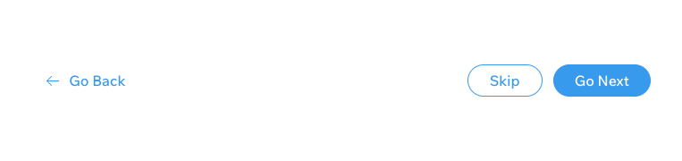</td>
  </tr>
  <tr>
    <td class="do">DO</th>
    <td class="dont">DON'T</td>
  </tr>
  <tr>
    <td>Use schematic drawings to communicate structural areas that accept node content type.</td>
    <td>Don’t use sample content as it doesn’t visually explain multiple content areas. </td>
  </tr>
</table>

 
Showcase the effect of different values passed to the same prop if it helps to communicate the possibilities component provides. Use text to communicate what values have been passed and the effect it made.

<table class="noborder">
	<tr>
    <td class="preview"></td>
    <td class="preview">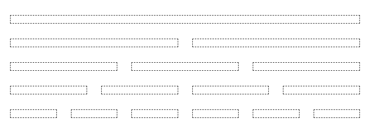</td>
  </tr>
  <tr>
    <td class="do">DO</th>
    <td class="dont">DON'T</td>
  </tr>
  <tr>
    <td>Use content to communicate available options and difference it makes.</td>
    <td>Don’t leave blank space and force user to check code to figure out difference in code.</td>
  </tr>
</table>

 
If a component has a predefined value types, stick to these to showcase primary and recommended usage of a component. If content type is text, use it to explain area name and purpose.

If i.e. ‘title’ also accepts node content, it should be mentioned in a description and API.
<table class="noborder">
	<tr>
    <td class="preview">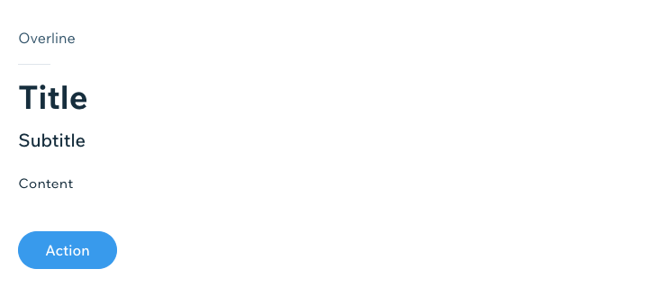</td>
    <td class="preview">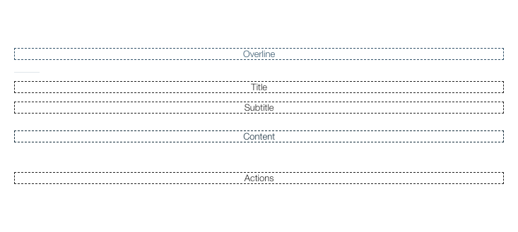</td>
  </tr>
  <tr>
    <td class="do">DO</th>
    <td class="dont">DON'T</td>
  </tr>
  <tr>
    <td>Use default styling for areas with predefined content types.</td>
    <td>Don’t override predefined styling with placeholder content.</td>
  </tr>
</table>

 
Use other components from the library to explain mechanism containers behaviour, such as modal call out, native file upload, etc.

<table class="noborder">
	<tr>
    <td class="preview"></td>
  </tr>
  <tr>
    <td class="do">DO</th>
  </tr>
  <tr>
    <td>Use components from the library to explain containers that provide mechanisms.</td>
  </tr>
</table>

##### Description
Structure example description should state:

* what areas component consist of (if there are multiple areas only)
* which areas are mandatory and which are optional
* what type and amount of children elements areas accept 
* how to control component behaviour (for mechanism containers only)

<table class="noborder">
	<tr>
    <td class="preview" style="width:50%">
      <strong>Structure</strong>
      
Component consists of a title area and actions container (optional). Actions bar can contain any number of CTA items

    </td>
    <td class="preview" style="width:50%">
      <strong>Structure</strong>
      
Basic structure of a component

    </td>
  </tr>
  <tr>
    <td class="do">DO</th>
    <td class="dont">DON'T</td>
  </tr>
</table>

<table class="noborder">
	<tr>
    <td class="preview" style="width:50%">
      <strong>Structure</strong>
      
Render modal content by using children prop. Control modal appearance with props:

      <ul>
      	<li>isOpen - this bool prop shows and hides the modal.</li>
		<li>onRequestClose - this prop calls a function you request. It can be used to control isOpen prop.</li>
      </ul>
    </td>
    <td class="preview" style="width:50%">
      <strong>Structure</strong>
      
A simple example for modal with an alert

    </td>
  </tr>
  <tr>
    <td class="do">DO</th>
    <td class="dont">DON'T</td>
  </tr>
</table>

### 2. Properties

Property examples step by step introduce users to component features. This section should reveal and explain full component capabilities, also how to handle common edge cases (i.e. text wrapping).

Each component has a set of properties and features to explain. Examples of them should be listed from least to most complex ones. Priority might differ depending on a component, but most commonly it follows this order:

* Appearance
* States
* Content
* Behaviour

##### Visuals
Be aware that users are visual learners by nature. Examples we provide should be as self explanatory as possible. 

In order to decide what content inside of a snippets would be suitable think about the following:

* What am I trying to communicate to the user (list of options to choose from, what behaviour property enables, etc.)?
* What is a property type (is it visual by its own, or does it need guidance)?
* How could we efficiently use initial component features to provide meaningful context?
* Could we help to set correct content patterns via snippets?

 
In cases where example lists down available value options use predefined component elements (if there are any) to communicate how passed value affects component appearance or behaviour.

<table class="noborder">
	<tr>
    <td class="preview">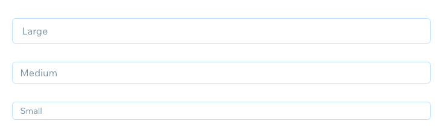</td>
    <td class="preview"></td>
  </tr>
  <tr>
    <td class="do">DO</th>
    <td class="dont">DON'T</td>
  </tr>
  <tr>
    <td>Utilize component elements to communicate available prop values.</td>
    <td>Don’t use meaningless placeholder titles which force you to look for information somewhere else.</td>
  </tr>
</table>

 
Merge statuses into a single snippet for interactive components. Use labels to communicate how each status is called.

<table class="noborder">
	<tr>
    <td class="preview"></td>
    <td class="preview"></td>
  </tr>
  <tr>
    <td class="do">DO</th>
    <td class="dont">DON'T</td>
  </tr>
  <tr>
    <td>Display all different states in a single snippet and use labels to display state name.</td>
    <td>Don’t use placeholder labels when your intention is to communicate different states.
</td>
  </tr>
</table>

 
Display single feature at the time. If example purpose is to list down the options, don’t complicate it with content which is not relevant at that specific moment.

<table class="noborder">
	<tr>
    <td class="preview">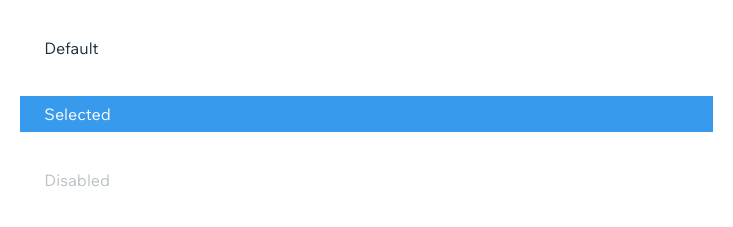</td>
    <td class="preview"></td>
  </tr>
  <tr>
    <td class="do">DO</th>
    <td class="dont">DON'T</td>
  </tr>
  <tr>
    <td>Only display content which is necessary to communicate example purpose, i.e. existing states.</td>
    <td>Don’t add content which is irrelevant in scenario you're showcasing (i.e. prefix icon in states example).
</td>
  </tr>
</table>

 
In cases where property value affects the content which is allowed to be displayed inside of a component use real case examples. This approach provides the user with context what each value is designed for, and also sets right content patterns.

<table class="noborder">
	<tr>
    <td class="preview"></td>
    <td class="preview">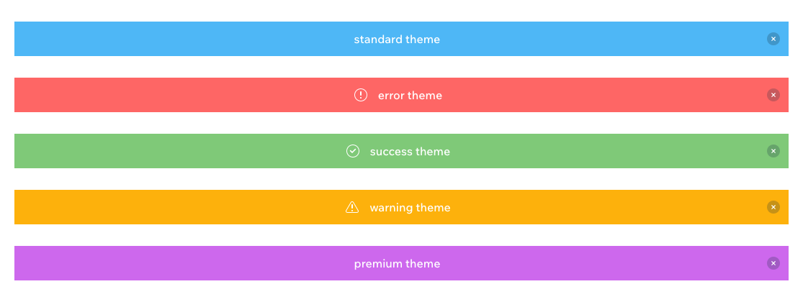</td>
  </tr>
  <tr>
    <td class="do">DO</th>
    <td class="dont">DON'T</td>
  </tr>
  <tr>
    <td>Use real case content which both explains when skin could be used and sets correct content patterns.</td>
    <td>Don’t communicate value names only when there’s a direct dependency between accepted messaging and selected theme.
</td>
  </tr>
</table>

 
Use real content to demonstrate edge cases handling. It showcases the behaviour and sets correct content patterns at the same time. Avoid gibberish text that doesn't bring benefit.

<table class="noborder">
	<tr>
    <td class="preview"></td>
    <td class="preview">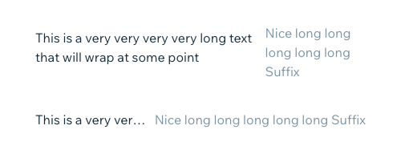</td>
  </tr>
  <tr>
    <td class="do">DO</th>
    <td class="dont">DON'T</td>
  </tr>
  <tr>
    <td>Use real content for text overflow demonstration to set right content patterns.</td>
    <td>Don’t use gibberish text which don’t bring benefit for a user.
</td>
  </tr>
</table>

 
Merge directly dependent or same purpose properties into a single example (i.e. width and height could be a single example named ‘Dimensions’).

<table class="noborder">
	<tr>
    <td class="preview"></td>
    <td class="preview">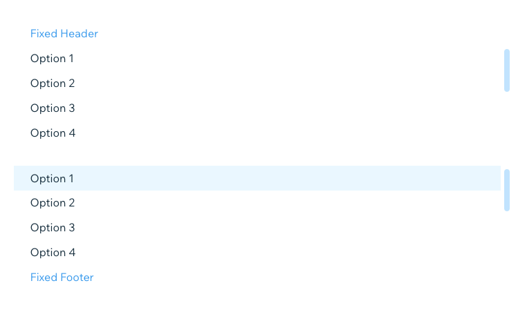</td>
  </tr>
  <tr>
    <td class="do">DO</th>
    <td class="dont">DON'T</td>
  </tr>
  <tr>
    <td>Display similar purpose properties in a single example.</td>
    <td>Don’t create separate examples for similar purpose props. It increases story length unnecessarily.
</td>
  </tr>
</table>

 
Don't merge property values which serve different purposes. Provide each of them with a dedicated example inside of the same snippet. Use real and meaningful copy to communicate purpose better.

> In example, selection items inside of a dropdown layout can be grouped using subheader or divider, but intentions are different. Subheader provides a name for a group. While divider separates list item that provide entirely different results, i.e. will add another field to the form where you can specify a custom length of a plan.

<table class="noborder">
	<tr>
    <td class="preview" style="width:50%">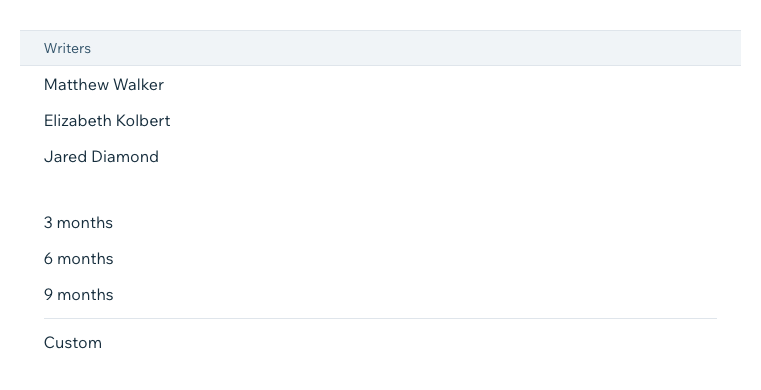</td>
    <td class="preview" style="width:50%">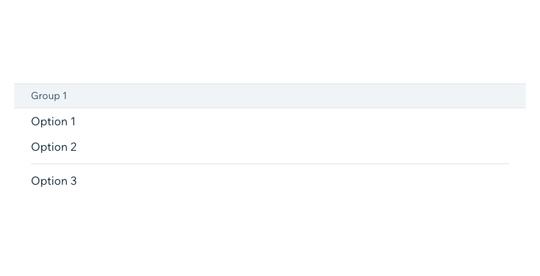</td>
  </tr>
  <tr>
    <td class="do">DO</td>
    <td class="dont">DON'T</td>
  </tr>
  <tr>
    <td>Have a dedicated item with a real use case for each layout variation in a single snippet to communicate the purpose clearly.</td>
    <td>Don’t merge two prop variations with entirely different intentions in a single layout. It doesn't explain when each type should be used and how they are different.
</td>
  </tr>
</table>

 
List property examples in order of priority. Check the table below for the most common order and examples which properties could be merged together in a single example.

<table>
    <td>Category</td>
    <td>Group</td>
    <td>What to show per snippet?</td>
  </tr>
  <tr>
    <td>1</td>
    <td>2</td>
    <td>3</td>
  </tr>
</table>

